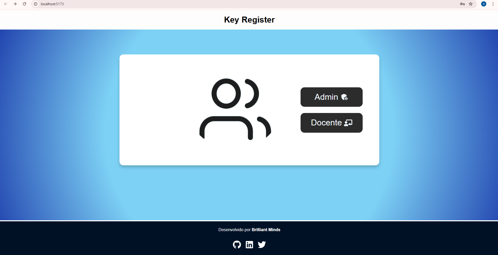
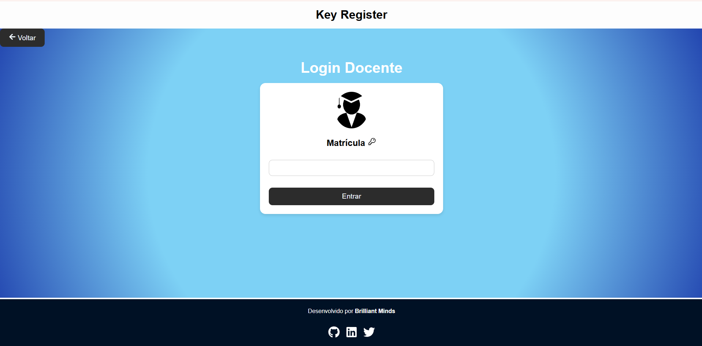
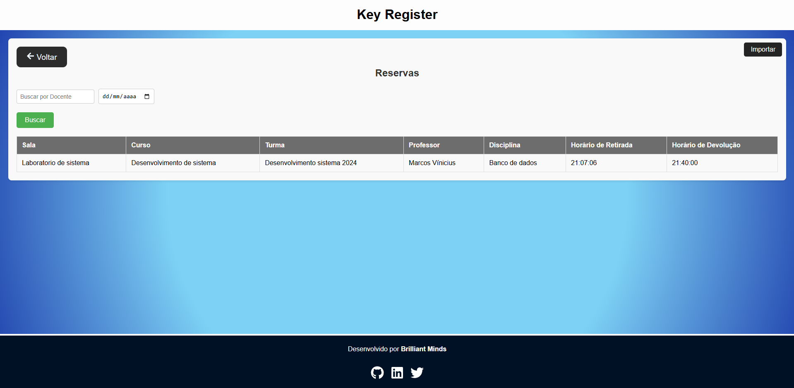
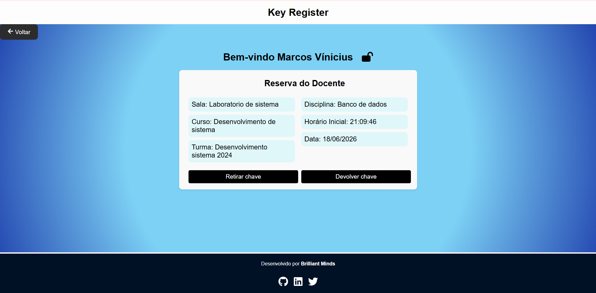
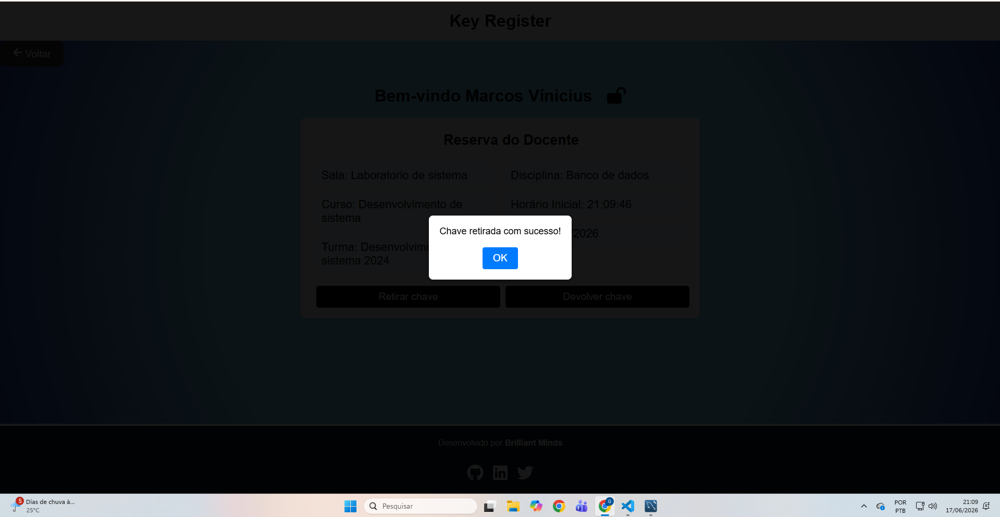

# 🔑 Key Register 2.0

Sistema web desenvolvido para gerenciamento e controle de empréstimo de chaves em instituições de ensino.

O projeto foi criado como Trabalho de Conclusão de Curso (TCC) do curso Técnico em Desenvolvimento de Sistemas, com o objetivo de substituir processos manuais de controle de chaves por uma solução digital, proporcionando mais organização, rastreabilidade e segurança no gerenciamento dos recursos da instituição.

---

## 📖 Sobre o Projeto

O Key Register 2.0 permite o controle de retirada e devolução de chaves de salas e ambientes institucionais, registrando todas as movimentações em banco de dados para garantir maior segurança e rastreabilidade.

A aplicação foi desenvolvida utilizando uma arquitetura cliente-servidor, composta por um frontend em React, um backend em Node.js e um banco de dados MySQL.

---

## ✨ Funcionalidades

- Cadastro de docentes
- Cadastro de salas
- Cadastro de chaves
- Registro de retirada de chaves
- Registro de devolução de chaves
- Controle de disponibilidade das chaves
- Consulta de reservas
- Histórico de movimentações
- Registro automático de horários
- Integração com banco de dados MySQL
- Consumo de APIs REST

---

## 🛠️ Tecnologias Utilizadas

### Frontend

- React
- JavaScript
- HTML5
- CSS3
- Vite

### Backend

- Node.js
- Express.js

### Banco de Dados

- MySQL

### Ferramentas

- Git
- GitHub
- Trello
- Jest

---

## 🏗️ Arquitetura

```text
Frontend (React)
        │
        ▼
Backend (Node.js + Express)
        │
        ▼
Banco de Dados (MySQL)
```

---

## 📂 Estrutura do Projeto

```text
KeyRegister2.0
│
├── Frontend/
├── Backend/
├── Planilhas/
├── keyregister.sql
└── README.md
```

---

## 🚀 Como Executar o Projeto

### Pré-requisitos

Antes de começar, você precisará ter instalado:

- Node.js
- MySQL
- Git

### 1. Clonar o Repositório

```bash
git clone https://github.com/gustta11/KeyRegister2.0.git
```

### 2. Acessar o Diretório

```bash
cd KeyRegister2.0
```

### 3. Configurar o Banco de Dados

Importe o arquivo SQL disponível no projeto para criar a estrutura do banco de dados.

### 4. Instalar as Dependências

#### Backend

```bash
cd Backend
npm install
```

#### Frontend

```bash
cd Frontend
npm install
```

### 5. Configurar as Variáveis de Ambiente

Crie um arquivo `.env` no backend contendo as informações de conexão com o banco de dados:

```env
DB_HOST=localhost
DB_USER=seu_usuario
DB_PASSWORD=sua_senha
DB_NAME=keyregister
PORT=5000
```

### 6. Executar o Projeto

#### Iniciar o Backend

```bash
npm start
```

ou

```bash
node server.js
```

#### Iniciar o Frontend

```bash
npm run dev
```

A aplicação estará disponível em:

```text
http://localhost:5173
```

---

## 🎯 Objetivos do Projeto

- Digitalizar o controle de empréstimo de chaves.
- Eliminar registros manuais em papel.
- Melhorar a organização administrativa.
- Garantir rastreabilidade das movimentações.
- Aumentar a segurança no gerenciamento dos recursos da instituição.
- Facilitar consultas e auditorias futuras.

---

## 👨‍💻 Minha Participação

Durante o desenvolvimento deste projeto participei de:

- Desenvolvimento da interface utilizando React.
- Desenvolvimento de APIs REST com Node.js e Express.
- Modelagem e integração com banco de dados MySQL.
- Implementação das funcionalidades de retirada e devolução de chaves.
- Versionamento de código utilizando Git e GitHub.
- Planejamento e organização das tarefas utilizando Trello.
- Criação e execução de testes da aplicação.

---

## 📸 Demonstração

Adicione aqui imagens da aplicação para facilitar a visualização do projeto.

### Tela de Login

```html

```
### Tela de Login Adm

```html

```
### Tela de Login Docente

```html

```

### Dashboard

```html

```

### Painel Docente

```html

```

### Retirada feita

```html

```

---

## 📈 Aprendizados

O desenvolvimento deste projeto proporcionou experiência prática em:

- Desenvolvimento Frontend com React.
- Desenvolvimento Backend com Node.js.
- Criação e consumo de APIs REST.
- Modelagem de banco de dados relacionais.
- Integração entre frontend e backend.
- Testes automatizados.
- Controle de versão com Git e GitHub.
- Trabalho em equipe utilizando metodologias ágeis.

---

## 🔮 Melhorias Futuras

- Implementação de autenticação e autorização por perfis.
- Dashboard com indicadores e relatórios.
- Notificações automáticas de devolução.
- Histórico avançado com filtros.
- Exportação de relatórios em PDF e Excel.
- Responsividade para dispositivos móveis.

---

## 📄 Licença

Projeto desenvolvido para fins acadêmicos e educacionais.

---

## 📬 Contato

**Gustavo Keven**

- LinkedIn: www.linkedin.com/in/gustavo-keven-17bb5a1b4
- GitHub: https://github.com/gustta11

Caso tenha interesse em contribuir ou tirar dúvidas sobre o projeto, fique à vontade para entrar em contato.
